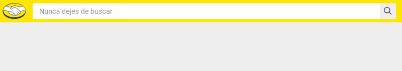
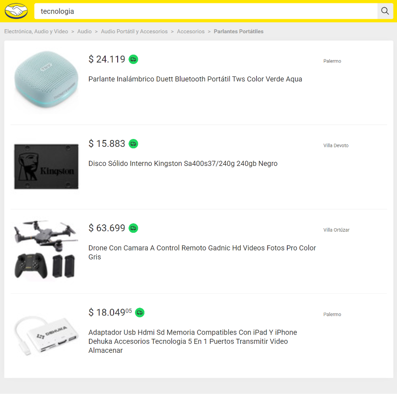

<a name="readme-top"></a>

# Practical Front-end test for Mercado Libre

## About The Project

Web application that consists of three views:
* Search box
* Results page
* Product details page

### Built With

[![React][React.js]][React-url] [![Typescript][Typescript]][Typescript-url] [![Express][Express]][Express-url] [![Jest][Jest]][Jest-url] [![Zustand][Zustand]][Zustand-url] [![Vite][Vite]][Vite-url] [![Sass][Sass]][Sass-url] 


<!-- GETTING STARTED -->
## Getting Started


### Prerequisites

Node >= 16
* npm
  ```sh
  npm install npm@latest -g
  ```

### Installation


1. Clone the repo
   ```sh
   git clone https://github.com/angelluis90/meli-frontend-test
   ```
2. Install dependencies
   ```sh
   npm install
   ```
## Usage
  In a terminal, run one of the command below:
   * **Development** *(Go to the URL shown in the terminal. Default: **http://localhost:5173/**)* 
   ```sh
   npm run dev
   ```
   
   * **Production**
   ```sh
   npm run build
   ```

## Views

### Search box


### Search results


### Details


## Contact

### Angel Luis Gonzalez Martinez


Email: [angelluisglez90@gmail.com](mailto:angelluisglez90@gmail.com)

Linkedin: [https://www.linkedin.com/in/angel-luis-gonzalez-martinez/](https://www.linkedin.com/in/angel-luis-gonzalez-martinez/)

Project Link: [https://github.com/angelluis90/meli-frontend-test](https://github.com/angelluis90/meli-frontend-test)

[React.js]: public/tech/reactjs.png
[React-url]: https://reactjs.org/

[Express]: public/tech/express.png
[Express-url]: https://expressjs.com/

[Typescript]: public/tech/typescript.png
[Typescript-url]: https://www.typescriptlang.org/

[Jest]: public/tech/jest.png
[Jest-url]: https://jestjs.io/

[Sass]: public/tech/sass.png
[Sass-url]: https://sass-lang.com

[Vite]: public/tech/vite.png
[Vite-url]: https://vitejs.dev/

[Zustand]: public/tech/zustand.png
[Zustand-url]: https://zustand-demo.pmnd.rs/
